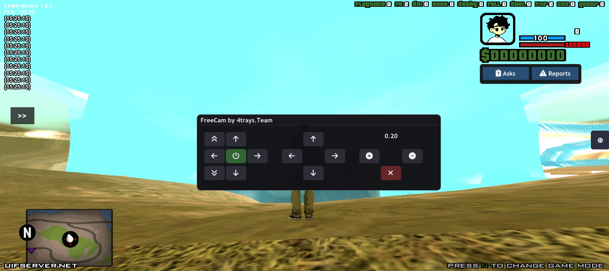

###  govhelper gta sa-mp cross platform! &nbsp;

Hello! I want to present my project in the form of an FreeCam for players as the content creator/rp maker, which in this context is the GTA SA-MP player generally. 

###  &nbsp; Among them are some of the features below:

- simple gui & button design (imitating camhack for a reason)
- full control of all camera angles, including rotation etc. (better and cooler than camhack)
- main menu that can be accessed with the command (/fcam) which displays control inteface in-game
- Fresh button and icon design with fAwesome6_solid. (better than camhack)

<a href="https://sfl.gl/kcWR" target="_blank">Download FreeCam</a>
